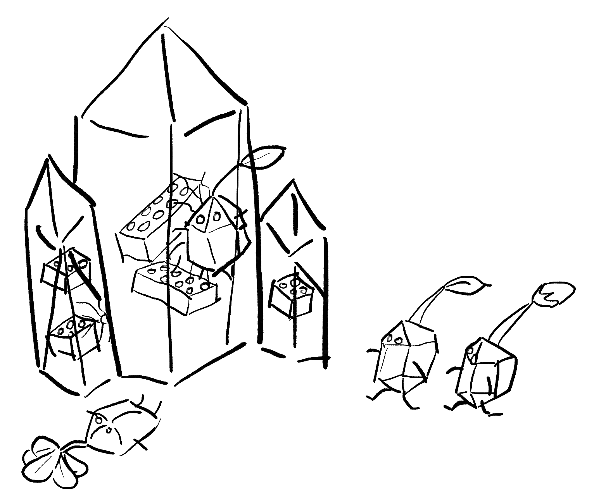
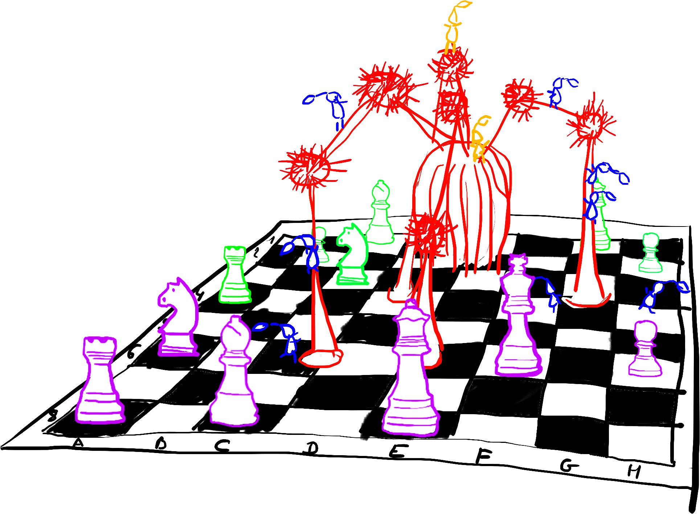
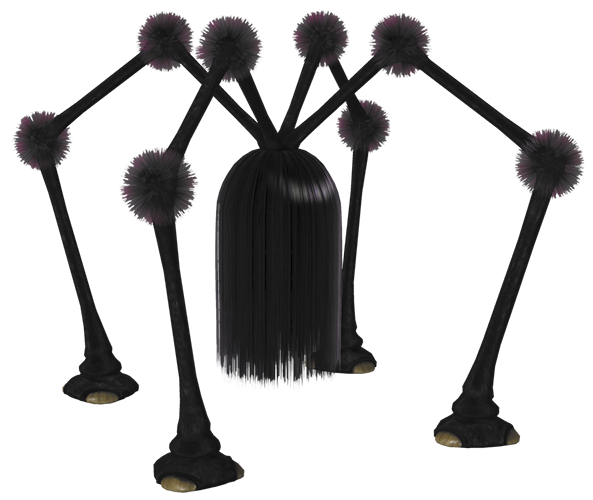
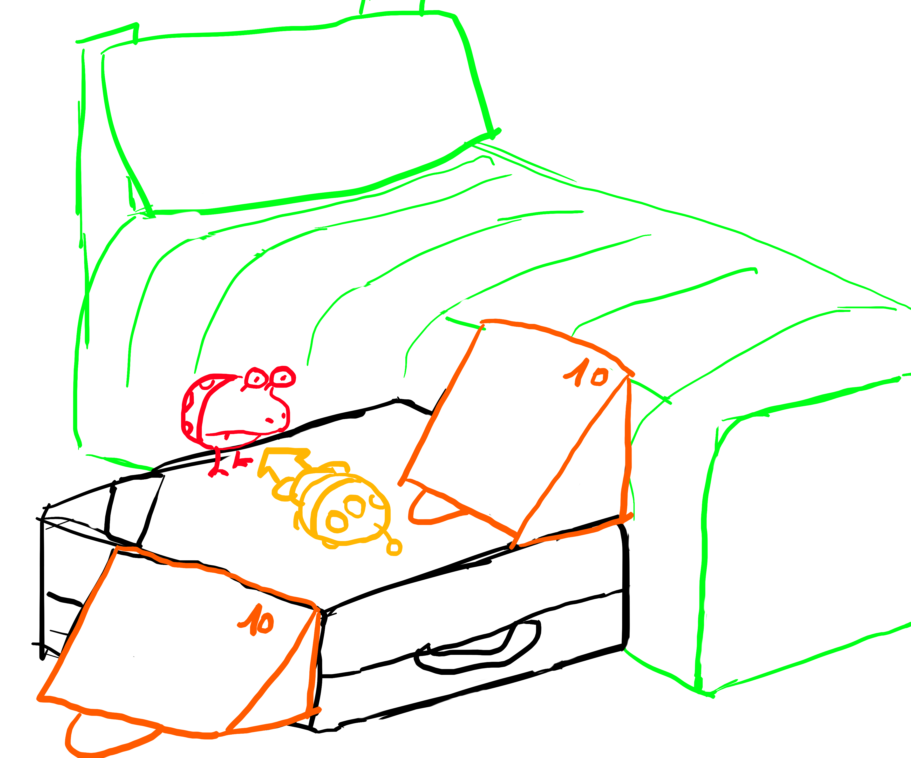
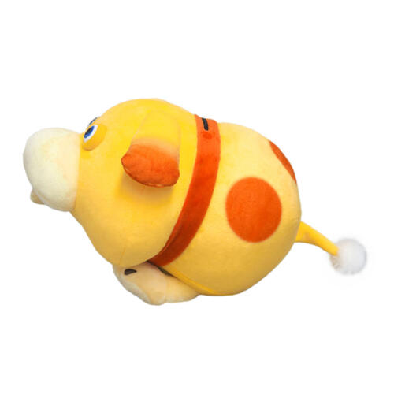

# Pikmin puzzle inside a bedroom

Methodology :

- Sketch using Affinity Designer (Persona) - sketch/genai_pikmin_scene
- Create description of the sketch and iterate with ChatGPT5.2 - see following prompts
- Submit sketch and description to NanoBanana to render the scene - see following renders

## Overview

## Scene 1 : Rock pikmins with lego bricks

### Enclosed sketch

### Prompt

A cute, official Nintendo-style 3D scene inspired by Pikmin, rendered as a miniature diorama.

The scene takes place inside a bright bedroom, featuring a stylized wooden herringbone parquet floor.

The parquet slats are intentionally exaggerated and extremely wide, each slat as wide as ten Pikmin standing side by side, clearly breaking realistic proportions. The camera is placed low and close to the floor, making the massive width of the parquet slats dominate the foreground, strongly emphasizing the miniature diorama scale of the Pikmin.

In the left foreground of the frame, several large transparent glass blocks shaped like faceted crystal gemstones with sharp but clean edges are resting on the floor.

From the right side of the scene, one rock Pikmin are joyfully and forcefully launched mid-air toward the left, frozen at the moment of impact as they collide with the glass blocks. Two other rock Pikmin are running to the right. One rock Pikmin is rolling on the floor after the impact.

Inside the crystal-clear glass blocks, toy-like LEGO bricks are trapped and clearly visible, in bright blue, red, and yellow colors, adding playful color accents.

The impact is visible but gentle and playful: fine cracks spread across the glass surfaces, small glass shards lie on the wooden floor, and subtle debris is suspended near the collision points, suggesting motion without violence.

The rock Pikmin are cute and expressive, with rounded shapes, simple faces, and soft proportions. Some have a green leaf, others a pink bud, and a few a fully bloomed pink flower on their heads.

The scene features soft Nintendo-style lighting, clean materials, high-detail yet friendly textures, and a whimsical, polished look, staying fully consistent with the official Pikmin universe aesthetic.

### Render

## Scene 2 : Shaggy Long Legs on chessboard

### Enclosed sketch

### Additional image

### Prompt

(I enclose two images, the first one is a sketch of the scene to be rendered, the second one is a png of shaggy long legs, the Pikmin monster appearing in red in the first sketch)

A cute, official Nintendo-style 3D scene inspired by the Pikmin universe, rendered as a miniature diorama.

The scene takes place inside a bright bedroom, featuring a highly stylized wooden herringbone parquet floor. The parquet is intentionally exaggerated and non-realistic, with very wide wooden slats dominating the foreground. The camera is placed low and close to the floor, emphasizing the tiny scale of the Pikmin relative to the environment.

Resting on the floor is a large wooden chessboard, viewed from a slightly low angle. The chessboard squares are oversized, and wooden chess pieces are scattered across it. Some pieces are light wood (white pieces, sketched in purple) and others dark wood (black pieces, sketched in blue), with a few pieces tilted or fallen, suggesting chaos.

At the center of the chessboard stands a Shaggy Long Legs, a Pikmin boss creature (sketched in red). It resembles a giant black spider-like creature with exactly four long legs. Each leg is thin and elongated, with two visible joints, and each joint is partially hidden by small tufts of dark hair.

The four legs connect directly to a central spherical body, which is fully covered in long, shaggy black hair. The body is lifted above the chessboard, suspended by the legs, with no visible face beneath the hair.

The Shaggy Long Legs is mid-motion, appearing to walk across the board: one leg is lifted high, about to slam down and crush a chess square, while the other three legs support its weight.

Several Pikmin are actively attacking the creature. Four red Pikmin (sketched in blue) are climbing and clinging to the monster’s legs, gripping the hair and joints. Two yellow Pikmin (sketched in yellow) are leaping onto and striking the central hairy body, their movements frozen mid-action.

The Pikmin are cute and expressive, with rounded shapes and simple faces, clearly visible against the dark monster.

The scene uses soft Nintendo-style lighting, clean materials, and high-detail yet friendly textures, balancing playful charm with a sense of dynamic action, staying fully consistent with the official Pikmin universe aesthetic.

### Render

## Scene 3 : Suitcase with bulborb and Oatchi Pikmin

### Enclosed sketch

### Additional images

### Prompt 1

A cute, official Nintendo-style 3D scene inspired by the Pikmin universe, rendered as a miniature diorama.

The scene takes place inside a bright bedroom, featuring a highly stylized wooden herringbone parquet floor. The parquet is intentionally exaggerated and non-realistic, with very wide wooden slats dominating the foreground. The camera is placed low and close to the floor, emphasizing the tiny scale of the Pikmin relative to the environment.

Resting on the floor near the bed (sketched in green) is a large, old-fashioned brown leather suitcase (sketched in black), lying on its main side. The suitcase has soft leather surfaces, visible seams and buckles, and a worn, vintage look. Its handle is facing the camera, making it a clear foreground element.

Two solid triangular-prism ramps (sketched in orange) are placed next to the suitcase, forming a clear climbing path. Each ramp is a three-dimensional wedge-shaped volume, not a flat sheet.

Each ramp has a clearly visible triangular cross-section, with three solid faces:
– one flat rectangular top surface forming the ramp
– one slanted triangular side face
– one vertical triangular end face, clearly showing its thickness

The ramps are resting firmly on the floor and on the suitcase, with their edges and faces clearly visible, making their 3D volume obvious from the camera angle.

The ramps have a kraft paper / papercraft texture, as if made from folded cardboard, and each ramp has a small printed number “10” on one of its faces, reinforcing their handmade, toy-like nature.

Standing on top of the suitcase is a Bulborb (sketched in red), a round Pikmin monster with a hungry expression, its body turned directly toward Oatchi. The Bulborb’s posture suggests alertness and anticipation, as if it has noticed the incoming threat.

On the suitcase surface, directly in front of the Bulborb, Oatchi (sketched in blue, second enclosed image) is captured mid-run, with his entire body oriented toward the Bulborb. Oatchi is looking straight at the Bulborb, leaning forward with determination, frozen in the moment just before attacking, making the confrontation feel immediate and intentional.

The scene uses soft Nintendo-style lighting, clean materials, and high-detail yet friendly textures, with a playful, whimsical tone consistent with the official Pikmin universe aesthetic.

### Prompt 2

Along the papercraft ramps, seven Winged (Pink) Pikmin are all flying in the same direction, forming a single, unidirectional ascent from the floor up to the bed.

The Winged Pikmin are clearly originating from the ground, then flying upward onto the suitcase, and finally continuing their movement toward the bed, with all Pikmin facing and moving toward the bed. There are no Pikmin descending, turning back, or facing the opposite direction.

Their motion is explicitly upward and forward, reinforcing the idea of a careful transport route from the floor to the bed, rather than a return path.

The Winged Pikmin are fully airborne, hovering and flying above the ramps rather than walking on them. Their small transparent wings are actively flapping, and their feet are lifted off the surface, clearly showing that flight is supporting their movement.

Each Winged Pikmin is carrying a transparent marble that appears heavy relative to their small body size. The marbles are large compared to the Pikmin, causing the Pikmin to lean forward slightly, strain under the weight, and fly more slowly and carefully.

Each marble is unique, with different internal colors, reflections, and subtle textures, and is held firmly with visible effort, reinforcing the sense that the marbles are precious and difficult to transport.

The Winged Pikmin have blue eyes and small transparent wings.

- Two Winged Pikmin have a leaf on their head
- One has a flower bud
- Four have a fully bloomed flower

### Render

